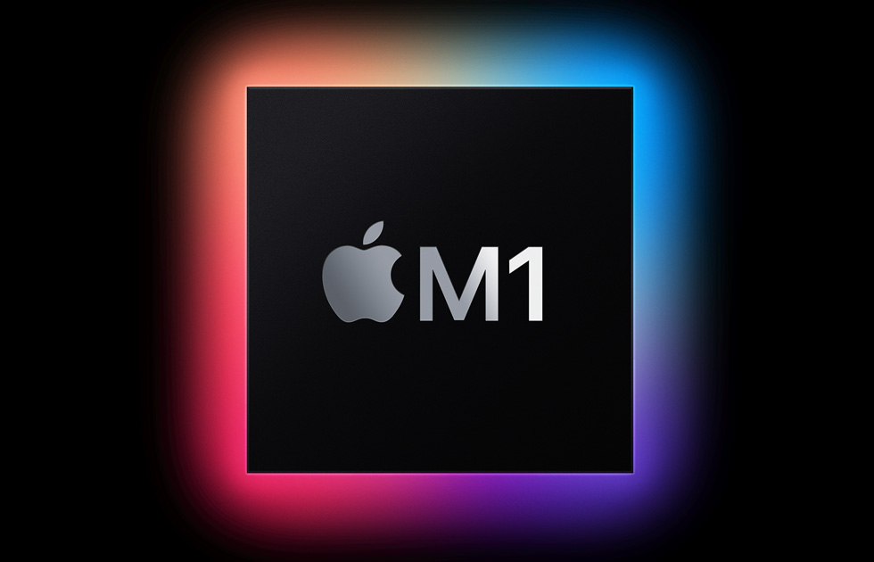

# Setup PyTorch for Apple M1 Series
This repo includes instructions for installing PyTorch for the latest Apple Silicon M1 Macbook Pro, and related M1 machines. With all its powers, the new Apple M1 series provides powerful workspace to harness the processing capabilities towards faster potentials with MacOS.


Followig provides precise steps to follow for installing PyTorch on M1.

1. Install Xcode
Some of the M1 Macbooks have Xcode preinstalled and some does not have it. If your machines does not have it, downloaded it freely from the App Store, and then run this command to install the Xcode Command Line:

```
xcode-select --install
```

2. Install MiniForge
Similar to MiniConda or Anaconda, MiniForge is a conda installer which has better compatinilty (in my experience) with MacOS including the M1 series. For that, download the installer for Apple M1 (OSX, arm64, Miniforge3-MacOSX-arm64) from [here](https://github.com/conda-forge/miniforge). Once downloaded, execute: 
```
bash Miniforge3-MacOSX-arm64.sh
```
One thing worth mentioning is that I had another conda distribution already installed so I skipped installing MiniForge (which you should ideally do). However, I did not get satisfactory installation results so I had to uninstall the existing conda distribution and install MiniForge.

3. Setup a New Conda Environment
Once the compatible conda distribution is installed, the next step is to creat and then activate a new environment. For that, execute:
```
conda create --name pytorch_applem1 python=3.8
conda activate pytorch_applem1
```
